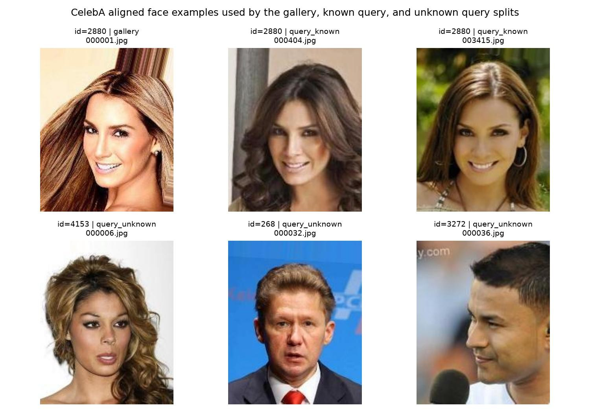
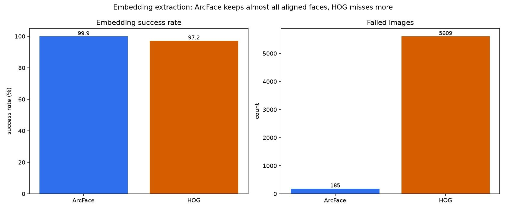
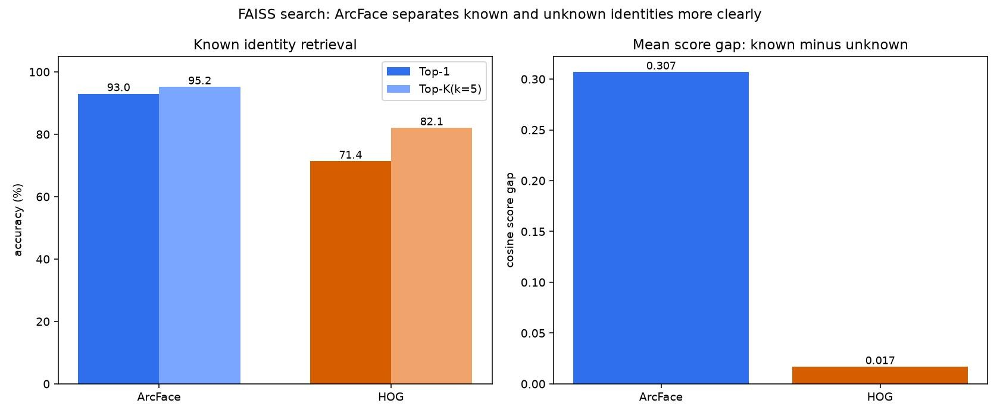
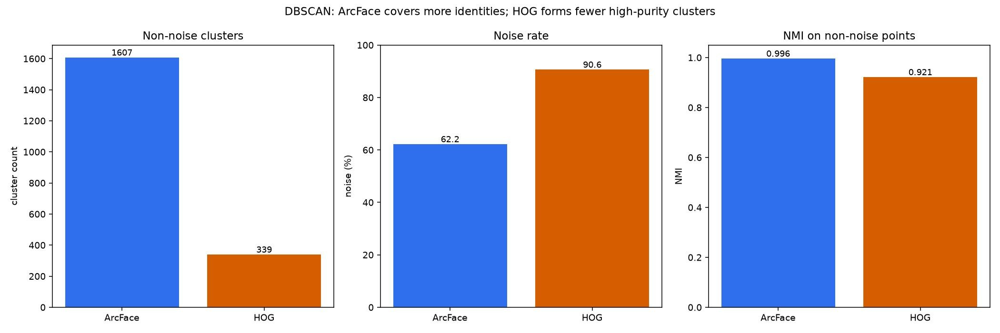
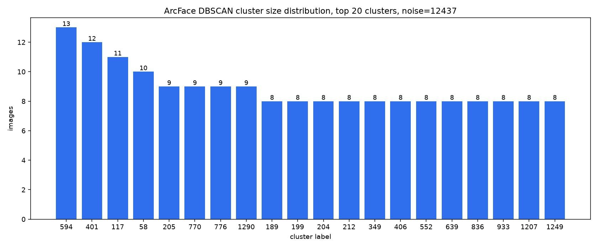
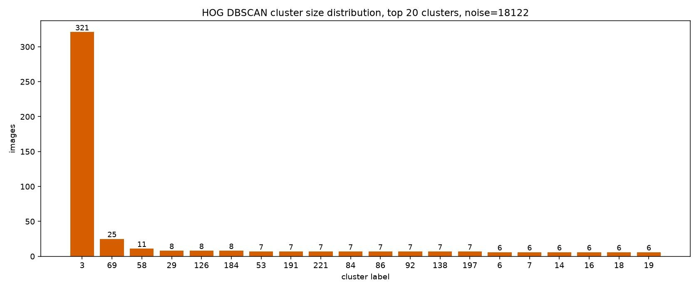
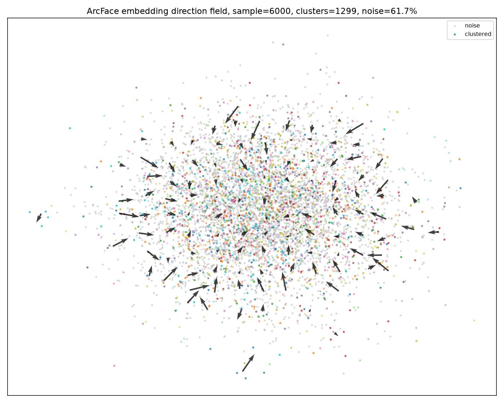
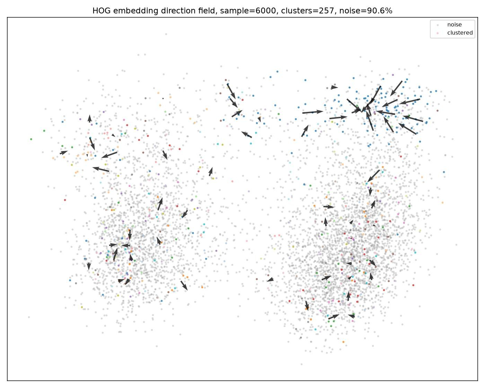
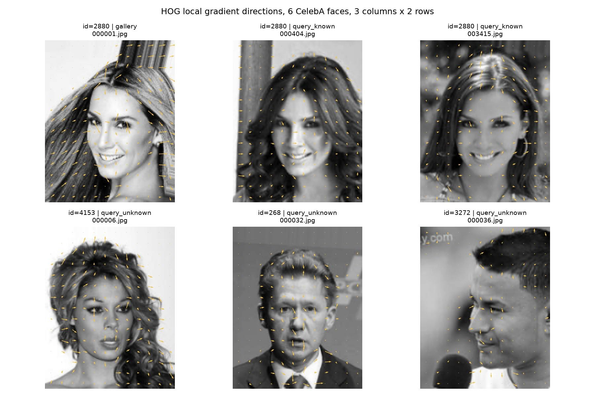

# 人脸识别实验结果报告

本报告基于全量 CelebA 对齐人脸数据。实验跑了两条 embedding 路线：

- ArcFace：当前主路线，输出 512 维 embedding。
- HOG/dlib：CPU baseline，输出 128 维 embedding。

两条路线都进入同样的后处理实验。FAISS 用来做 1:N 检索和陌生人拒识，DBSCAN 用来做无监督聚类和 2D 可视化。这样比较的是 embedding 本身带来的差异，而不是后处理流程差异。

## 数据集结构

CelebA 是一组已经对齐的人脸图片，每张图片有一个身份编号。本实验用身份编号把图片分成三类：`gallery` 是向量库里的已知照片，`query_known` 是同一批已知身份的其他照片，`query_unknown` 是不在 gallery 里的身份。这样可以同时测试“同一个人能不能找回来”和“陌生人会不会被误接收”。

上图第一行展示同一个身份的多张照片，说明 gallery 和 known query 不是同一张图的重复检索。第二行展示不同身份的照片，说明 unknown query 和身份区分任务来自同一套数据集。

## embedding 提取结果

ArcFace 成功处理 202414 张图，失败 185 张，成功率约 99.91%。HOG 成功处理 196990 张图，失败 5609 张，成功率约 97.23%。

这说明在已经对齐的人脸图上，HOG 仍然会漏掉一部分样本。ArcFace 路线虽然整体耗时更长，但它保留了更多后续可用的样本。

| 路线 | 输入图片 | 成功 embedding | 失败图片 | 成功率 |
| --- | ---: | ---: | ---: | ---: |
| ArcFace | 202599 | 202414 | 185 | 99.91% |
| HOG | 202599 | 196990 | 5609 | 97.23% |

## FAISS 检索结果

FAISS 实验使用 gallery 建库，然后分别查询 `query_known` 和 `query_unknown`。`query_known` 用来测同一身份能不能找回来，`query_unknown` 用来测陌生人是否容易被误接收。

ArcFace 的 Top-1 准确率是 93.04%，Top-K(k=5) 准确率是 95.22%。HOG 的 Top-1 准确率是 71.42%，Top-K(k=5) 准确率是 82.11%。

更关键的是分数间隔。ArcFace 的 known 平均分是 0.595，unknown 平均分是 0.288，间隔约 0.307。HOG 的 known 平均分是 0.953，unknown 平均分是 0.936，间隔只有约 0.017。这个现象说明 HOG 的分数很难把熟人和陌生人拉开，阈值会更难选。

| 路线 | known query | unknown query | Top-1 | Top-K(k=5) | known 均分 | unknown 均分 |
| --- | ---: | ---: | ---: | ---: | ---: | ---: |
| ArcFace | 172592 | 20669 | 93.04% | 95.22% | 0.595 | 0.288 |
| HOG | 168034 | 20105 | 71.42% | 82.11% | 0.953 | 0.936 |

这里的 `K=5` 表示每张 query 会从 FAISS 返回最相似的 5 个 gallery 候选。Top-1 只看第一个候选是否命中，Top-K(k=5) 看前 5 个候选里是否出现正确身份。

## DBSCAN 聚类结果

DBSCAN 实验和 FAISS 不同。FAISS 是给一张 query 找人，DBSCAN 是不给标签，让算法自己把 embedding 分成组。当前 DBSCAN 使用 20000 个样本做聚类和可视化。

DBSCAN 参数不是直接套默认值，而是分别扫描路线和距离度量。判断依据包括非噪声簇数量、噪声率、最大簇占比、ARI 和 NMI。最大簇占比用来判断是否串成大簇；NMI 和 ARI 只用真实身份标签做事后评估，不参与聚类本身。

最终 ArcFace 使用 `metric=cosine, eps=0.56`，聚出了 1607 个非噪声簇，噪声率 62.19%，非噪声点 NMI 是 0.996。最终 HOG 使用 `metric=euclidean, eps=0.40`，聚出了 339 个非噪声簇，噪声率 90.61%，非噪声点 NMI 是 0.921。这个结果说明 HOG 不是完全不能聚类，而是覆盖率低：它能聚出一部分较纯的小簇，但会把更多图片标成噪声。

| 路线 | 样本数 | 非噪声簇 | 噪声点 | 噪声率 | 非噪声 NMI |
| --- | ---: | ---: | ---: | ---: | ---: |
| ArcFace cosine eps=0.56 | 20000 | 1607 | 12437 | 62.19% | 0.996 |
| HOG euclidean eps=0.40 | 20000 | 339 | 18122 | 90.61% | 0.921 |

| 扫描组合 | 结果观察 | 是否采用 |
| --- | --- | --- |
| ArcFace + cosine | `eps=0.56` 时噪声下降，最大簇仍很小，NMI 保持约 0.996 | 采用 |
| ArcFace + euclidean | 当前扫描区间全部变成噪声点 | 不采用 |
| HOG + cosine | 当前扫描区间全部连成一个大簇 | 不采用 |
| HOG + euclidean | `eps=0.40` 能形成高纯度小簇，`eps=0.50` 开始出现大簇风险 | 采用 |

## 聚类分布和向量场

上面的分布图直接显示了 DBSCAN 的主要簇大小。ArcFace 有大量小而分散的身份簇，HOG 在 euclidean 参数下也能形成一批小簇，但噪声点更多。

下面的方向场图把 embedding 先压到 PCA 2D，再在网格中画出局部样本指向所属簇中心的平均方向。它不是物理意义上的向量场，而是用来观察 embedding 空间中样本如何向簇中心归拢。

ArcFace 的图中，局部方向分布在多个区域，说明它在 embedding 空间里形成了较多局部结构。HOG 的局部结构更稀疏，能形成一些小簇，但覆盖范围明显低于 ArcFace。

## HOG 特征直觉

上图补充说明 HOG baseline 在检测阶段关注的内容。HOG 会把图像分成小网格，在每个网格里统计灰度变化最明显的方向。脸部轮廓、眼睛、鼻梁和嘴部会形成一组方向模式，传统检测器靠这些方向模式判断哪里像人脸。它和 ArcFace embedding 不同：ArcFace 直接学习身份相关的深度特征，HOG 更像是在描述局部边缘结构。

## 结论

ArcFace 在这个实验里明显更适合作为主路线。它的检测和编码成功率更高，FAISS 检索准确率更高，而且 known 与 unknown 的分数间隔更大。这个分数间隔对陌生人拒识很重要，因为它决定阈值是否有可操作空间。

HOG baseline 的价值在于说明传统路线的边界。它能跑完整个流程，也能产出 embedding；在 DBSCAN 上通过 euclidean 参数可以聚出一部分较纯的小簇，但覆盖率明显低于 ArcFace。后续报告可以继续保留 HOG 作为 baseline，但产品主线应该围绕 ArcFace embedding 展开。
